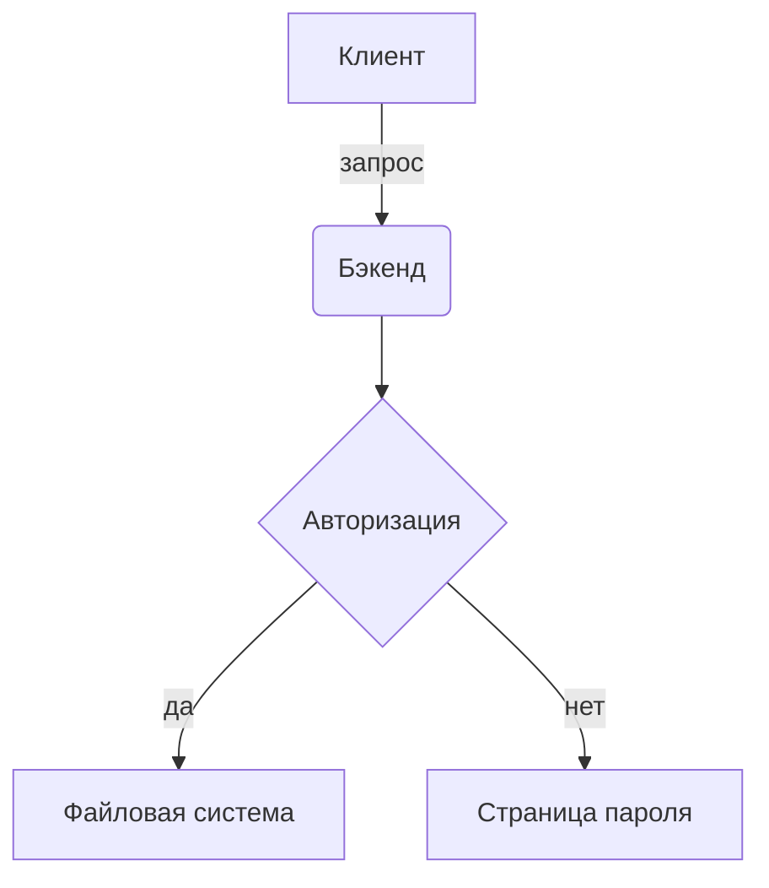

# Кастомные компоненты

Vordoc расширяет стандартный Markdown собственными виджетами.

## Callouts

Warning[Важно]{Это встроенный виджет **Warning**. Он поддерживает *Markdown* внутри тела.}

Danger[Осторожно]{Виджет **Danger** подсвечивает критическую информацию.}

## Изображения и галереи

Image[public/sample.svg]{Демонстрационное изображение}

Gallery[120px;public/sample.svg;public/sample.svg]

## Файловая галерея

FilesGallery[public/notes.txt|Заметки команды;https://example.com/report.pdf|Внешний отчёт]

## Диаграмма Mermaid



## Блок кода с подсветкой

```go
package main

import "fmt"

func main() {
    fmt.Println("Hello, Vordoc!")
}
```

## Таблица

| Возможность | Синтаксис | Уровень |
|-------------|-----------|---------|
| Callout | `Warning[title]{body}` | Блок |
| Галерея | `Gallery[items...]` | Блок |
| Изображение | `Image[src]{alt}` | Блок |
| Файлы | `FilesGallery[files...]` | Блок |
| Диаграмма | ` ```mermaid` | Блок |
