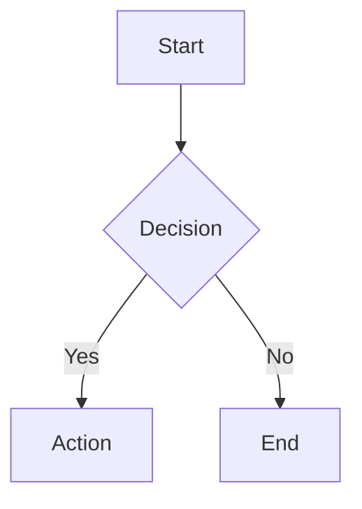

# Добро пожаловать в Vordoc

Vordoc — это генератор и просмотрщик документации. Markdown-файлы из папки `content` отдаёт Go-бэкенд, а фронтенд на Nuxt отображает их как статичное SPA.

## Структура контента

```
content/
├── config.yaml          # глобальная конфигурация сайта
├── text.json            # UI-тексты (переопределяет встроенные)
├── logotype.svg         # логотип по умолчанию
└── <doc>/               # каждая подпапка — отдельная документация
    ├── config.yaml      # название, заголовок, доступ
    ├── access.yaml      # дополнительные правила доступа
    ├── index.md         # главная страница
    ├── *.md             # остальные страницы
    └── public/          # статика документации
```

## CLI-команды

- `./vordoc run` — запустить сервер.
- `./vordoc pass <password>` — сгенерировать bcrypt-хеш для защиты страниц.
- `./vordoc version` — показать версию.
- `./vordoc init` — создать документацию `welcome`.
- `./vordoc init <name>` — создать документацию с указанным именем.

## Управление доступом

- По умолчанию документация публичная.
- `access: password` + `password_hash` включает защиту паролем.
- Правила наследуются вниз по дереву страниц.
- `access: none` или `access: public` сбрасывают наследование.

## UI-конфигурация

Глобальные настройки сайта задаются в `content/config.yaml`:

```yaml
root:
  enable: true
  title: "Vordoc"

header:
  enable: true
  elements: ["logo", "search", "theme-switch"]
  title: "Vordoc"
  logo:
    path: "logotype.svg"
    size: 40
  font:
    name: "FabergeDigital.otf"
    size: 24

theme:
  default: "system"
  accent-color: "#3b82f6"
```

## Кастомные Markdown-виджеты

### Gallery

Галерея изображений в одну строку. Первым аргументом можно задать высоту.

```markdown
Gallery[images/a.svg;images/b.svg;images/c.svg]

Gallery[300px;images/a.svg;images/b.svg]
```

### Image

Расширенное изображение с поддержкой фонового режима.

```markdown
Image[images/logo.svg]{Альтернативный текст}
Image[images/logo.svg;background]{Фоновое изображение}
```

### Warning

Блок-предупреждение с заголовком и телом из inline-Markdown.

```markdown
Warning[Внимание]{Это **важное** предупреждение.}
```

### Danger

Блок об опасных действиях.

```markdown
Danger[Опасно]{Не удаляйте файл `config.yaml`.}
```

### FilesGallery

Галерея файлов с иконками, заголовками и скачиванием. Аргументы разделяются `;`, а путь и заголовок — `|`.

```markdown
FilesGallery[files/readme.txt|Readme;files/data.csv|Data table]
```

### Mermaid

Диаграммы через синтаксис Mermaid внутри fenced code block с языком `mermaid`.

````markdown

````

## Стандартный Markdown

Помимо виджетов поддерживаются все привычные элементы: заголовки, списки, ссылки, изображения, блоки кода с подсветкой синтаксиса, таблицы, цитаты и горизонтальные линии.

Warning[Дальше больше]{Изучайте примеры в `content/pretty-test` и экспериментируйте со своей документацией.}
